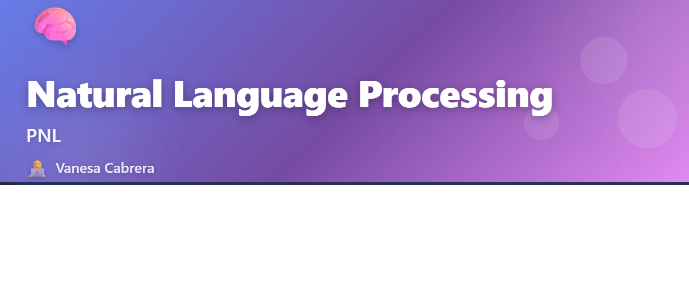

# 🧠 Natural Language Processing - PNL



<div align="center">

[](https://www.python.org/downloads/)
[](LICENSE)
[]()

**Repositorio de Procesamiento de Lenguaje Natural**

*Por Vanesa Cabrera*

</div>

---

## 📋 Sobre este Repositorio

Este repositorio contiene material completo sobre **Procesamiento de Lenguaje Natural (PNL/NLP)**, incluyendo fundamentos teóricos, implementaciones prácticas, ejercicios y proyectos integradores.

### ✨ Contenido

- 📖 Material teórico estructurado por módulos
- 💻 Notebooks interactivos con ejemplos prácticos
- 🔬 Proyectos de laboratorio y ejercicios resueltos
- 🧪 Implementaciones de algoritmos de NLP
- 🎓 Proyecto integrador completo

---

## 📁 Estructura del Proyecto

```
PNL/
├── 01 Introducción a PNL/           # Fundamentos de NLP
├── 02 Python/                        # Conceptos básicos de Python
├── 03 De sopa de letras al análisis lingüístico/
├── 04 Vectorización de texto y text mining/
├── 05 Text Mining/
├── 06 Introducción a embeddings/
├── 07 Redes Neuronales/
├── 08 Laboratorio de desarrollo/
├── cabrera-vanesa-nlp-integrador/   # Proyecto integrador
├── Colab Integrador/
└── Ejercicio a entregar/
```

📄 Ver [project_structure.md](project_structure.md) para más detalles.

---

## 🚀 Instalación

### Requisitos Previos

- Python 3.8 o superior
- pip (gestor de paquetes de Python)
- Git

### Pasos

```bash
# 1. Clonar el repositorio
git clone https://github.com/22823992-sudo/PNL.git
cd PNL

# 2. Crear entorno virtual (recomendado)
python -m venv venv
venv\Scripts\activate  # Windows

# 3. Instalar dependencias
pip install -r requirements.txt
```

---

## 📚 Módulos

### 1️⃣ Introducción a PNL
Conceptos fundamentales y aplicaciones del procesamiento de lenguaje natural.

### 2️⃣ Python para NLP
Estructuras de datos y librerías esenciales para trabajar con texto.

### 3️⃣ Procesamiento de Texto
Tokenización, normalización y limpieza de datos textuales.

### 4️⃣ Vectorización y Text Mining
Bag of Words, TF-IDF y análisis de frecuencias.

### 5️⃣ Text Mining Avanzado
Análisis de sentimientos, clasificación y extracción de información.

### 6️⃣ Embeddings
Word2Vec, GloVe y representaciones vectoriales de palabras.

### 7️⃣ Redes Neuronales
RNNs, LSTMs y arquitecturas modernas para NLP.

### 8️⃣ Laboratorio
Proyectos integradores y casos de uso reales.

---

## 💡 Uso

### Ejecutar Notebooks

```bash
# Iniciar Jupyter Notebook
jupyter notebook

# O usar Google Colab
# Abre: https://colab.research.google.com/
# Y carga los notebooks desde GitHub
```

### Ejemplo Rápido

```python
import pandas as pd
from sklearn.feature_extraction.text import TfidfVectorizer

# Ejemplo de vectorización
textos = ["Procesamiento de lenguaje natural", "Aprendiendo NLP"]
vectorizer = TfidfVectorizer()
X = vectorizer.fit_transform(textos)
print(X.toarray())
```

---

## 🛠️ Tecnologías

- **Python** - Lenguaje principal
- **NLTK** - Natural Language Toolkit
- **spaCy** - NLP industrial
- **scikit-learn** - Machine Learning
- **TensorFlow/PyTorch** - Deep Learning
- **Pandas/NumPy** - Manipulación de datos
- **Jupyter** - Notebooks interactivos

---

## 🤝 Contribuir

Las contribuciones son bienvenidas. Por favor lee [CONTRIBUTING.md](CONTRIBUTING.md) para más detalles.

---

## 📄 Licencia

Este proyecto está bajo la Licencia MIT.

---

## 📫 Contacto

**Vanesa Cabrera**

- GitHub: [@22823992-sudo](https://github.com/22823992-sudo)
- Repositorio: [PNL](https://github.com/22823992-sudo/PNL)

---

<div align="center">

**⭐ Si este proyecto te resultó útil, considera darle una estrella ⭐**

Made with ❤️ by Vanesa Cabrera

</div>